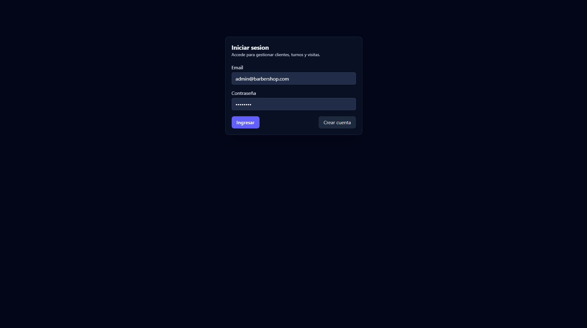
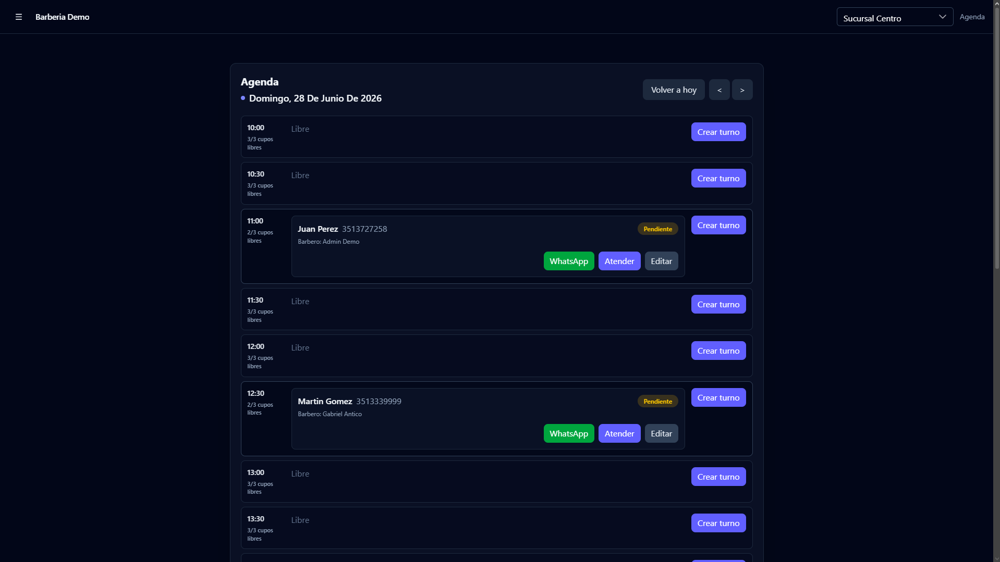
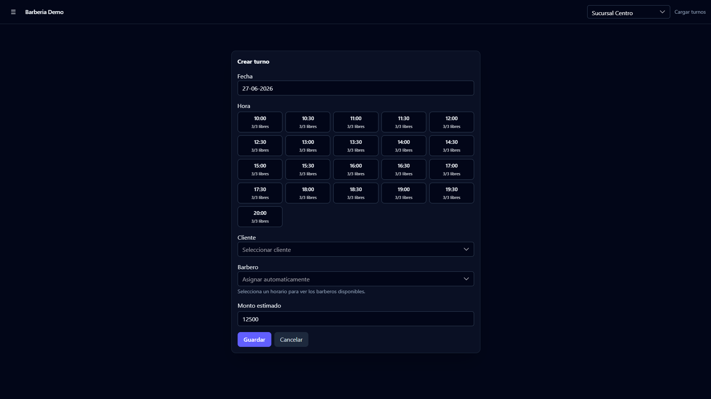
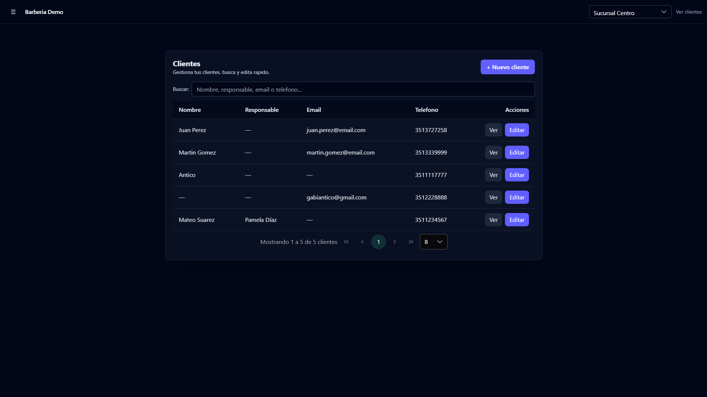
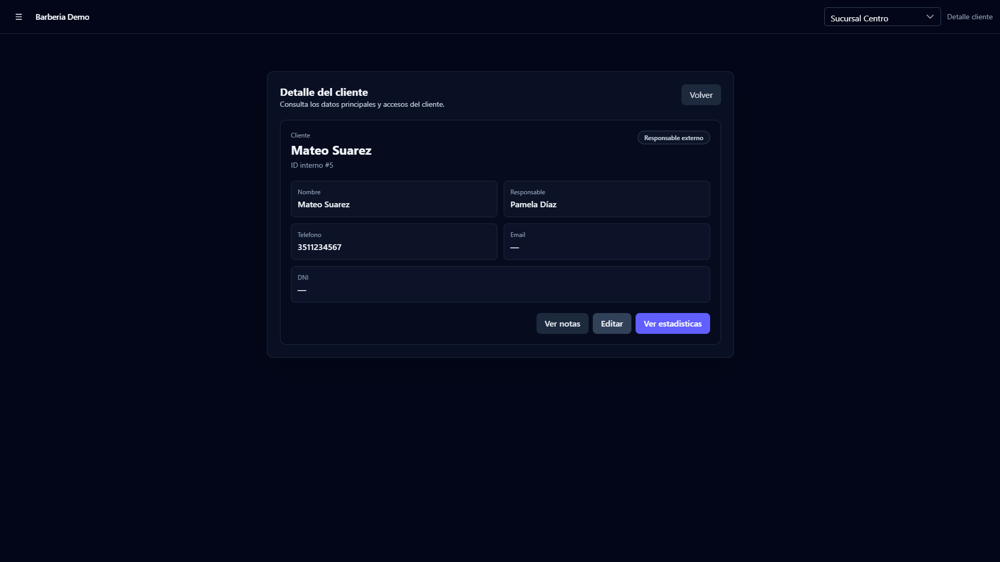
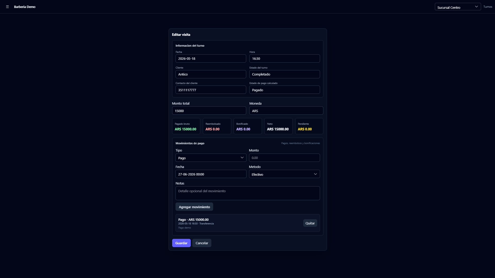
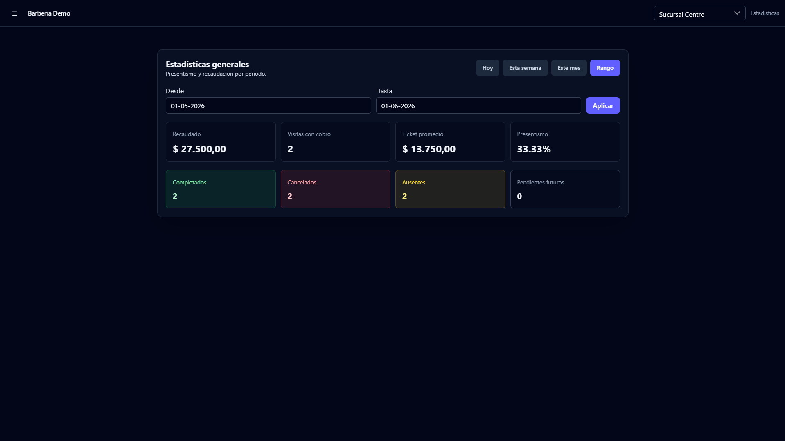
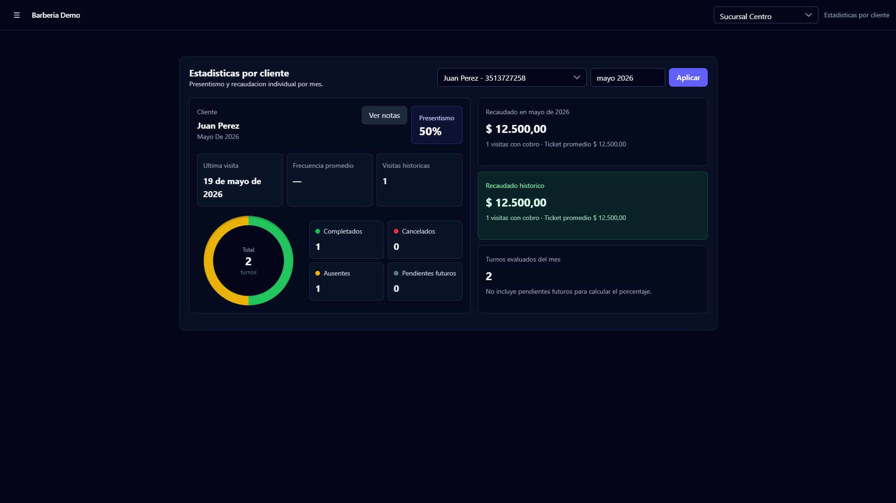
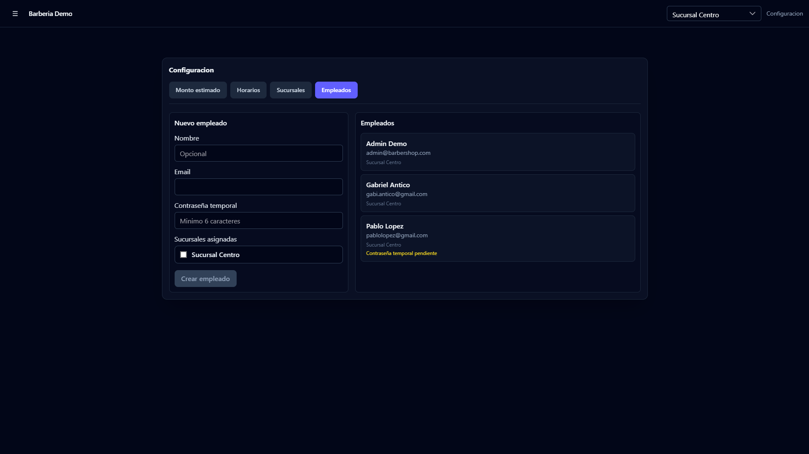

# Barbershop Manager

🌐 Language: **English** | [Español](./README.es.md)

[](https://barbershop-project-frontend.vercel.app)
[](https://barbershop-project-backend.onrender.com)
[](https://github.com/GabiAntico/barbershop-project-frontend)
[](https://github.com/GabiAntico/barbershop-project-backend)
[](#technologies)
[](#screenshots)

Full stack system for the daily operation of barbershops: appointments, clients, responsible contacts, employees, branches, availability, visits, payments, and business analytics.

The application is designed around a real-world workflow: helping a barbershop organize its day from mobile or desktop, avoid double bookings, track who handled each appointment, manage payments, and make better decisions with simple operational data.

## Live demo

[Open live demo](https://barbershop-project-frontend.vercel.app)

Demo user: `admin@barbershop.com`  
Demo password: configured for the demo/seed environment.

## Repositories

- Frontend: [barbershop-project-frontend](https://github.com/GabiAntico/barbershop-project-frontend)
- Backend: [barbershop-project-backend](https://github.com/GabiAntico/barbershop-project-backend)

## Problem

Many barbershops still manage appointments through messages, paper schedules, or spreadsheets. That works at first, but becomes fragile when cancellations, returning clients, multiple barbers, branches, pending payments, and revenue tracking enter the picture.

Barbershop Manager centralizes that workflow:

- Prevents appointment overlaps based on branch, availability, and working barbers.
- Supports clients whose appointment is managed by another responsible contact, such as a parent or guardian.
- Keeps clients shared across the barbershop while separating appointments and visits by branch.
- Lets the team complete appointments, register payment movements, and edit visits later.
- Provides general and per-client analytics for attendance, revenue, and visit frequency.
- Works on desktop and mobile, using tables on larger screens and cards on smaller screens.

## Main features

- Barbershop registration with an administrator user and initial branch.
- JWT-based login.
- Employee creation with temporary passwords and mandatory first-login password change.
- Branch management and active branch selector.
- Client management with required phone number, optional email, internal notes, and responsible contact.
- Client detail view with access to notes and analytics.
- Responsive daily agenda with date navigation.
- Appointment creation and editing through selectable time blocks.
- Slot capacity based on the number of available barbers.
- Automatic or manual barber assignment.
- Employee working hours customizable by branch.
- Default estimated amount, currency, and availability configuration.
- Availability setup by single date, date range, or all days.
- Appointment completion and visit creation.
- Visit editing to complete or correct payments.
- Financial movements per visit: payments, refunds, and bonuses.
- Payment status derived from movement balance.
- Tracking of the employee who handled each visit.
- General attendance and revenue dashboard.
- Client analytics with attendance, monthly revenue, historical revenue, and average visit frequency.
- Appointment export to PDF as a backup.
- Manual WhatsApp reminder from the agenda.
- Responsive UI with mobile cards.

## Technologies

Backend:

- Java 17
- Spring Boot 4
- Spring Security
- Signed JWT
- Spring Data JPA
- Hibernate
- Bean Validation
- Flyway
- H2 for development
- PostgreSQL for demo/deploy
- Maven
- Docker

Frontend:

- Angular 19
- TypeScript
- RxJS
- Angular Router
- Guards and HTTP interceptors
- PrimeNG
- Tailwind CSS
- Vercel

Demo infrastructure:

- Neon PostgreSQL
- Render
- Vercel

## Architecture

The system is split into two independent applications. This central repository, `barbershop-project`, works as a documentation hub to present the demo, architecture, and product screenshots.

```text
barbershop-project/
|-- docs/
|   `-- screenshots/     Product screenshots
|-- README.md            Main overview in English
|-- README.es.md         Main overview in Spanish
`-- .gitignore
```

Main flow:

```text
Angular App
   |
   | Authorization: Bearer <JWT>
   | X-Branch-Id: <active branch>
   v
Spring Boot API
   |
   | JPA / Hibernate + Flyway
   v
PostgreSQL / H2
```

Business model summary:

```text
Barbershop
|-- Branches
|-- Employees
|   `-- Working hours by branch
|-- Shared clients
|   `-- Optional responsible contact
`-- General settings

Branch
|-- Appointments
|   `-- Assigned barber
|-- Visits
|   `-- Payment movements
`-- Availability
```

The app works by context: the user signs in, chooses an active branch, and appointments, visits, availability, employees, and settings are filtered by that branch when applicable.

## Screenshots

### Login



### Agenda



### Create appointment



### Clients



### Client detail



### Visits and payments



### General analytics



### Client analytics



### Employee configuration



## Technical decisions

- Separate frontend and backend applications to allow independent deployments.
- Stateless authentication with signed JWT.
- Angular interceptor for attaching token and active branch to requests.
- Clients are shared at barbershop level to avoid duplication across branches.
- Appointments and visits are linked to a branch to keep operations and metrics separated.
- Appointment capacity is calculated in the backend based on assigned employees, working hours, and existing bookings.
- Availability validation also lives in the backend to protect data integrity even if the frontend fails.
- Responsible contacts model real cases where parents or guardians manage appointments for someone else.
- Payments are modeled as movements to support partial payments, refunds, and bonuses without losing history.
- Flyway versions database schema changes.
- Separate profiles: `dev` for local development and `demo` for the deployed demo.
- Idempotent `data.sql` seeds the demo with useful sample data.
- Responsive design: tables on desktop and cards on mobile.
- PDF appointment export acts as an operational backup.

## Next improvements

- Automatic reminders through the WhatsApp Business API.
- More granular roles and permissions.
- Logical deletion and audit trail for clients, appointments, and visits.
- At-risk clients based on absences or time since last visit.
- Reports by employee, branch, and period.
- Appointment change history.
- Automated tests for availability, payments, and multi-branch rules.
- `prod` profile with complete production configuration.
- Automated backups and error monitoring.

## Documentation

This repository works as the central documentation hub for the project: it summarizes the problem, the solution, the main technical decisions, the general architecture, the live demo, and product screenshots.
